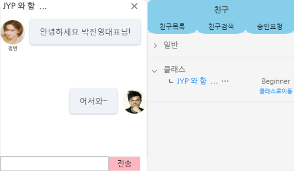

# It-Where-Project
영어를 잘 하기 위해 꼭 필요하지만, 지루하게 느껴질 수 있는 '단어 외우기'를 우리 홈페이지에서 제공하는 암기 기능을 이용하고,
다른 사람과 함께 함으로써 더 재밌게 영단어를 외울 수 있는 페이지 
 

   

## 개발 환경
* Programming Language    
Java 7
* DB  
Oracle
* Web  
HTML5, CSS, Javascript, jQuery
* Server  
Tomcat 8.5, JSP/Servlet
* Framework
Spring 4.0, Mybatis

## 주요 기능
* 계정
* 마이페이지
* 단어 저장 및 공유
* 스터디
* 커뮤니티
* 고객센터
* 관리자 전용 페이지

## DB 설계

    

## 페이지 소개

  
  <b>초기 페이지</b>  
  ㆍ 책갈피 형식으로 홈페이지 소개  
  ㆍ 로그인 기능
            
            

  
  <b>메인 페이지</b>  
  ㆍ 홈페이지 기획 의도 소개  
  ㆍ 공지사항 및 인기 단어장, 스터디, 게시글 소개

  
            
  

  
  <b style="text-align:center;">단어장</b>  
  ㆍ 여러개의 단어장 리스트  
  ㆍ 단어 추가 및 제거

  
            
  

  
  <b>스터디</b>  
  ㆍ 공동의 목표를 가진 사용자간 스터디 생성  
  ㆍ 스터디장이 만든 단어장을 구성원이 열람 및 암기 기능  
  ㆍ 단어 시험 기능

  
          

  
  <b style="text-align:center;">마이페이지</b>  
  ㆍ 책을 꺼내보는 형식으로 마이페이지 제공  
  ㆍ 자기소개 수정  
  ㆍ 가입한 스터디  
  ㆍ 단어장 목록  
  ㆍ 개인정보 수정

  
      

  
  <b style="text-align:center;">채팅</b>  
  ㆍ 사용자간 친구추가 기능  
  ㆍ 채팅 기능  

  
              

  
  <b style="text-align:center;">게시판</b>  
  ㆍ 기본 게시판 기능 제공  
  ㆍ 글 검색, 페이징 처리 및  
  ㆍ 최근 공지사항 최상단 배치  
  ㆍ 댓글 기능 및 댓글 신고 기능

  
       

  
  <b style="text-align:center;">문의</b>  
  ㆍ 사용자별 문의 작성  
  ㆍ 작성한 문의 확인  
  ㆍ 스터디, 단어장, 게시글, 불건전한 사용자에 대한 신고 가능

  
          

  
  <b style="text-align:center;">관리자</b>  
  ㆍ 한 페이지에서 전체 내용을 볼 수 있도록 구성한 화면  
  ㆍ 홈페이지의 총 방문자 수, 회원 수, 등록된 클래스 수 등 홈페이지의 정보 확인  
  ㆍ 회원 목록  
  ㆍ 회원 상세 조회로 신고된 내역 및 활동 내역 확인과 개인 메시지 전송 기능  
  ㆍ 문의 처리 기능  
  ㆍ Google Chart API를 이용해 단어, 클래스, 문의 유형, 방문 기록에 대한 통계 처리

  
  

## 담당 역할
* 초기 페이지
* 메인 페이지
* 게시판
* 문의 사항
* 관리자 페이지
* 위 기술한 내용에 대한 풀스택 개발
