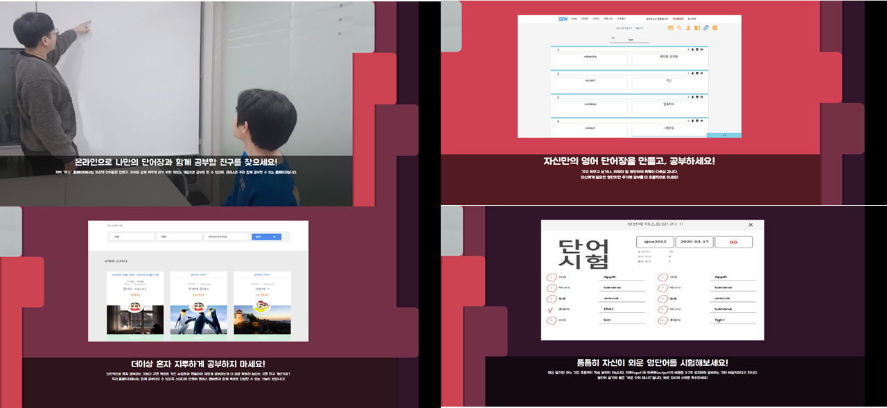
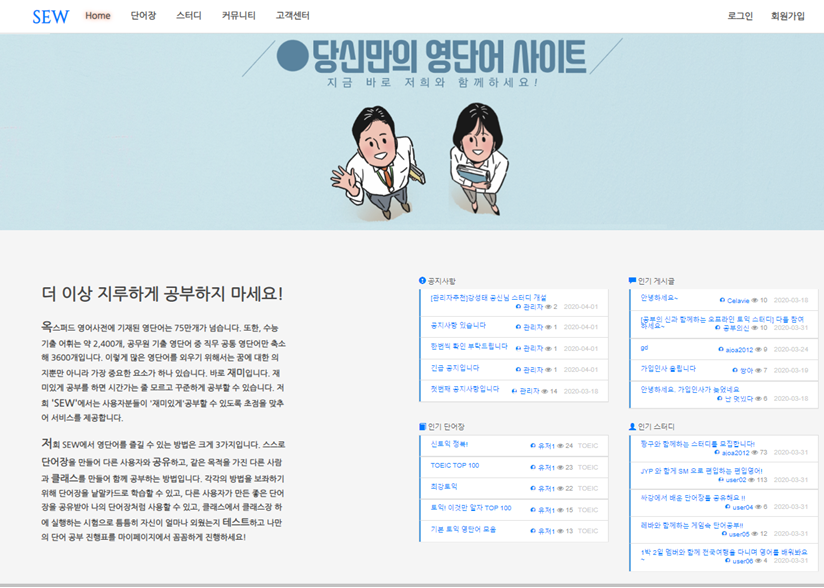
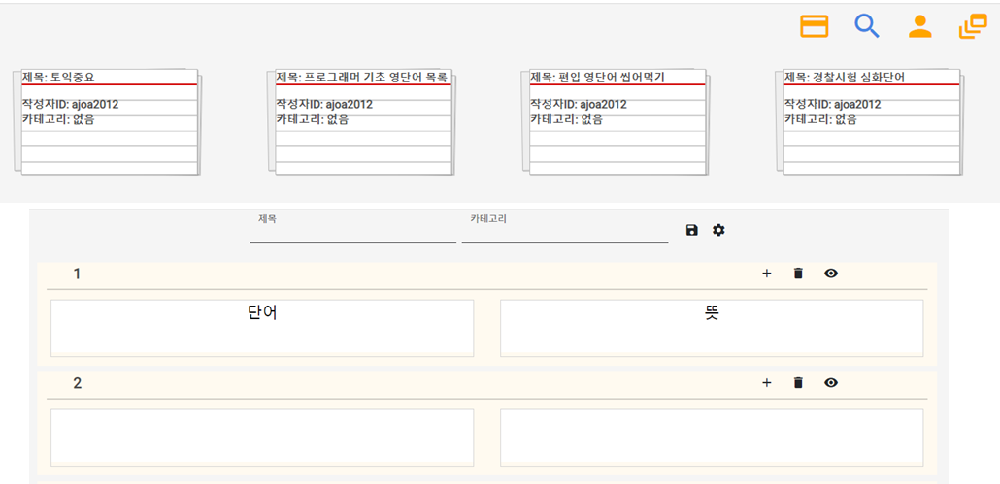
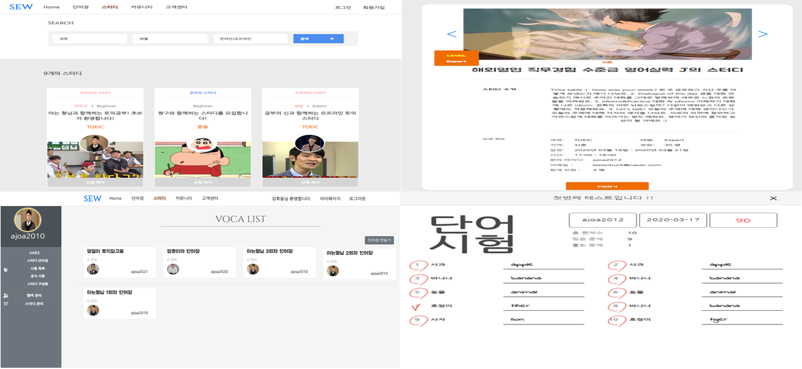
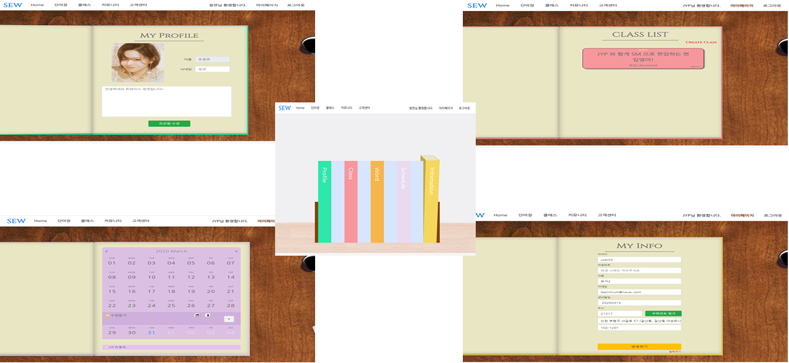
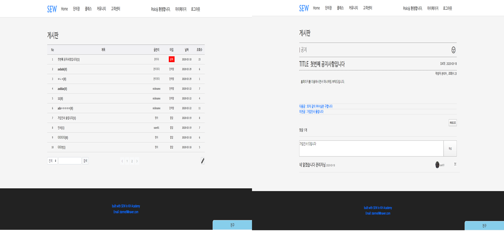
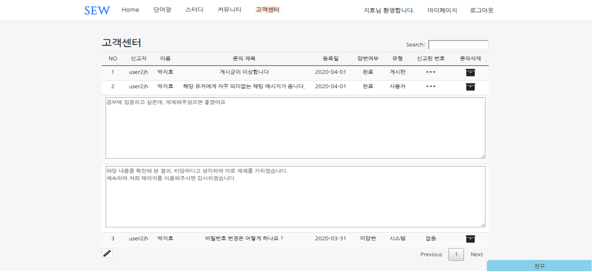
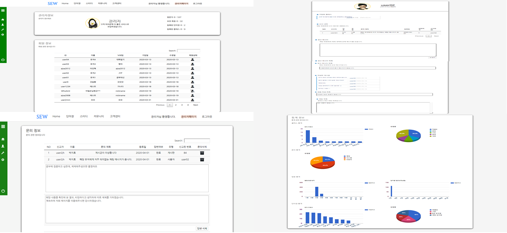
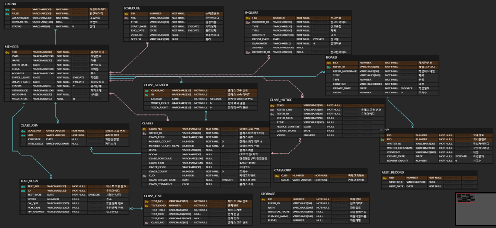

# It-Where-Project
2019년 KH 정보교육원에서 4인의 팀 구성으로 진행한 웹 개발 프로젝트입니다.  
웹 페이지에서 공동의 목표를 가진 이들이 그룹을 만들어 단어를 직접 제작하고 시험을 보며 원하는 목표를 달성하기 위해 만들어진 웹 사이트입니다.
 
 

 

## 개발 환경
* Programming Language    
Java 7
* DB  
Oracle
* Web  
HTML5, CSS, Javascript, jQuery
* Server  
Tomcat 8.5, JSP/Servlet
* Framework
Spring 4.0, Mybatis

## 담당 역할
* Member, Board, Reply, Visit_record, Inquire DB 설계
* 메인, 커뮤니티, 고객센터, 관리자 페이지 Full Stack 구현
* 관리자 페이지를 통한 사용자 제제 기능 구현
* Google Chart API를 이용한 인기 단어장, 클래스, 일별 사용자 접속 수 통계 구현

## DB 설계

    

